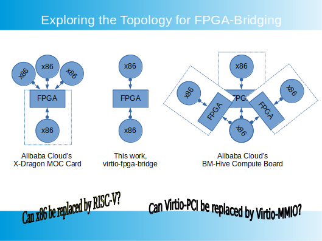
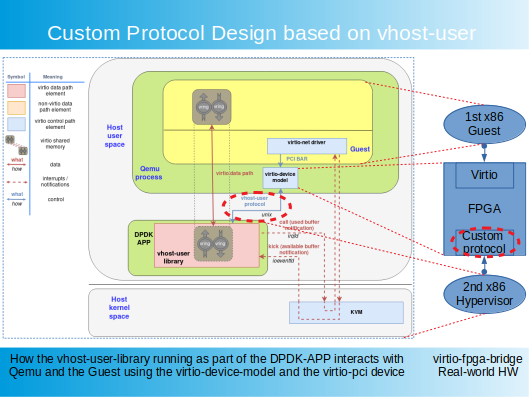

# virtio-fpga-bridge
A platform for emulating Virtio frontend and backend bridging with FPGAs.

# Introduction
With the [Qemu-HDL Cosim](http://compas.cs.stonybrook.edu/projects/fpgacloud/vm-hdl-cosim/) framework, it is now possible to run the full system emulation of [BM-Hive](https://www.semanticscholar.org/paper/High-density-Multi-tenant-Bare-metal-Cloud-Zhang-Zheng/ab1b5f0743816c8cb7188019d844ff3f7d565d9f) (Alibaba Cloud's X-Dragon, "Shenlong" in Chinese) on a single x86 PC.

## BM-Hive architecture

## virtio-fpga-bridge
The Virtio frontend runs on the 1st x86(Qemu), and the Virtio backend runs on the 2nd x86(Qemu). FPGA(HDL Sim) plays the role of bridging/synchronizing the frontend and backend, with shadow vrings and DMAs. 

There are two PCIe-EP IPs instantiated in the FPGA logic. The EP facing the 1st x86 is an implementation of the standard Virtio protocol. And there is no driver modification needed in the 1st x86 OS. The EP interfacing with the 2nd x86 is an implementation of a custom protocol, handling CSR/Mailbox registers and DMAs. And user space drivers, such as [ixy](https://github.com/emmericp/ixy), DPDK and SPDK, are needed for this interface.

# Discussion
## System topology
With Virtio's Virtqueue handling implemented in FPGA, there are many possible combinations of how the system can be constructed.

## HW limitations
BM-Hive requires special HW PCB board design, on which the x86 system is not available for many PCIe FPGA development boards. Adding a soft-core CPU inside the FPGA is an interesting option.

## Backend custom protocol design
The backend protocol of the FPGA bridge follows the same design principle of vhost-user protocol, which is customized to run solely over PCIe.

# Related Projects
[qemu-hdl-cosim](https://github.com/RSPwFPGAs/qemu-hdl-cosim)

[virtio-fpga](https://github.com/RSPwFPGAs/virtio-fpga)

[ixy Virtio driver with PCIe MMIO](https://github.com/RSPwFPGAs/ixy)

# Useful Links
[High-density Multi-tenant Bare-metal Cloud](https://www.semanticscholar.org/paper/High-density-Multi-tenant-Bare-metal-Cloud-Zhang-Zheng/ab1b5f0743816c8cb7188019d844ff3f7d565d9f)

[阿里云神龙架构入选ASPLOS 20'论文解读](https://developer.aliyun.com/article/750344)

[阿里云弹性裸金属服务器-神龙架构（X-Dragon）揭秘](https://developer.aliyun.com/article/594276)

[Vhost-user Protocol](https://github.com/qemu/qemu/blob/master/docs/interop/vhost-user.rst)

[Red Hat Blog: A journey to the vhost-users realm](https://www.redhat.com/en/blog/journey-vhost-users-realm)

[Red Hat Blog: Virtio-networking series 2019](https://www.redhat.com/en/blog/virtio-networking-first-series-finale-and-plans-2020)

[Red Hat Blog: Blogs on Virtualization](https://www.redhat.com/en/blog?f%5B0%5D=post_tags%3AVirtualization)

[KVM Forum 2019: VirtIO without the Virt](https://kvmforum2019.sched.com/event/TmxF/virtio-without-the-virt-towards-implementations-in-hardware-michael-tsirkin-red-hat)

[VIRTIO-USER: A New Versatile Channel for Kernel-Bypass Networks](https://www.semanticscholar.org/paper/VIRTIO-USER%3A-A-New-Versatile-Channel-for-Networks-Tan-Liang/5b24283ceb79f70b63cc87859a101930e0b23c1a)

[IOVTee: A Fast and Pragmatic Software-based Zero-copy/Pass-through Mechanism for NFV-nodes](https://www.semanticscholar.org/paper/IOVTee%3A-A-Fast-and-Pragmatic-Software-based-for-Kawashima-Matsuo/225ee620ec151bad9696983c68fd37781077b717#extracted)

