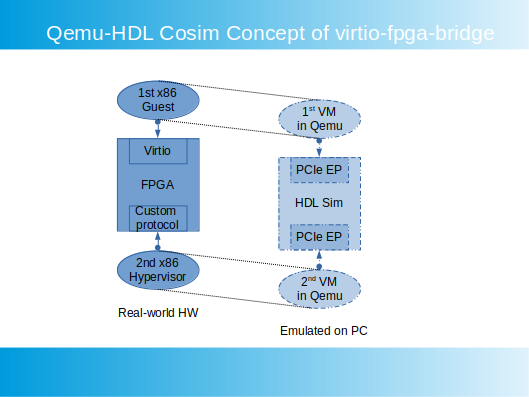

# virtio-fpga-bridge
A platform for emulatiing Virtio front-end and back-end bridge with FPGAs.

# Introduction
With the [Qemu-HDL Cosim](http://compas.cs.stonybrook.edu/projects/fpgacloud/vm-hdl-cosim/) framework, it is now possible to run the full system emulation of [Alibaba's BM-Hive](https://dl.acm.org/doi/10.1145/3373376.3378507) (X-Dragon) on a single x86 PC.

## Alibaba's BM-Hive

## virtio-fpga-bridge

The Virtio front-end runs on the 1st x86(Qemu), and the Virtio back-end runs on the 2nd x86(Qemu). FPGA plays the role of bridging the front-end and back-end, with shadow vrings and DMAs. 

There are two PCIe-EP IPs instantiated in the FPGA logic. The EP interfacing with the 1st x86 is an implementation of the standard Virtio protocol. And there is no driver modification needed in the 1st x86 OS. The EP interfacing with the 2nd x86 is an implementation of a custom protocol, handling CSR/Mailbox registers and DMAs. And user space drivers, such as [ixy](https://github.com/emmericp/ixy), DPDK and SPDK, are needed for this interface.

# Discussion
With Virtio's Virtqueue implemented in FPGA, there are many possible combinations of how the system can be constructed.

# Related Projects
[qemu-hdl-cosim](https://github.com/RSPwFPGAs/qemu-hdl-cosim)

[virtio-fpga](https://github.com/RSPwFPGAs/virtio-fpga)

[ixy Virtio driver with PCIe MMIO](https://github.com/RSPwFPGAs/ixy)

